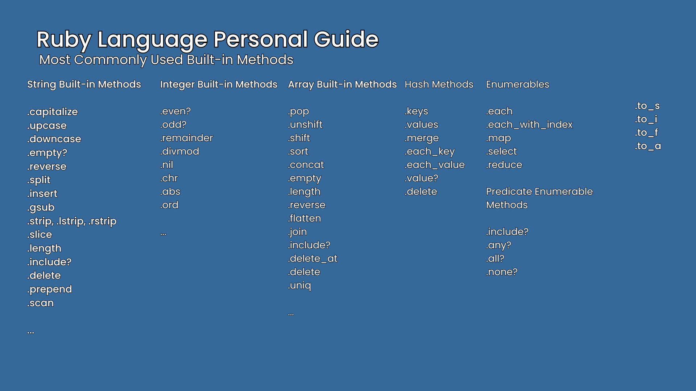

# my-ruby-projects
Ruby projects are saved within this repository. 

Each projects are saved on its respective branch so to find a specific project, you must select a branch from the dropdown.

Note: Some branch have multiple Ruby project like the ruby-exercises.

 
 

### My Ruby Guide
Ruby Docs: https://docs.ruby-lang.org/en/3.4/index.html

Below is the built-in methods of data types (objects) in Ruby that I ought to master. You can also use the <strong>#methods</strong> to show more of these. 

 

